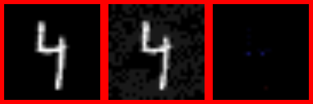

# Neural Networks from Scratch, and Adversarial Examples

[](https://github.com/zyx100089-eng/nn-from-scratch/actions/workflows/tests.yml)
[](https://www.python.org)
[](LICENSE)

> **Full write-up:** [report/report.md](report/report.md)

I wanted to understand what "the gradient of the loss" actually means,
so I built the whole thing: a reverse-mode autodiff engine, dense and
convolutional layers, batch norm, dropout, three optimisers, a
training loop — no PyTorch, no TensorFlow, no autograd library. Then I
used my own framework to study **adversarial examples**: perturbations
too small for a human to see that completely flip a model's
predictions.

Every gradient in this repo is either the chain rule applied by my
engine, or a hand-derived backward rule (convolution, max pooling,
batch norm). All of it is checked against numerical differentiation.

## The story in one paragraph

An MLP trained from scratch on MNIST reaches 89.4% test accuracy ([results/clean_accuracy.csv](results/clean_accuracy.csv)).
A perturbation bounded by 0.1 per pixel — invisible to the eye —
flips ~76% of its correct predictions with one gradient step (FGSM),
and ~84% when you iterate (PGD). I measured *why*: a ReLU network is
locally linear in its input, so a small perturbation moves the logits
exactly as the gradient predicts — ratio 1.00 at small scales. That's
Goodfellow's 2014 explanation, but measured rather than asserted.
Adversarial training (the standard defence) raises survival under
attack from 16% to 54%, and adversarial examples transfer between
different architectures.



*From `demo.py`: a correctly-classified "4" (86.4% confidence), the
same image after an FGSM step bounded by 0.1 per pixel — now
classified as a "9" — and the perturbation itself magnified 10×.*

## Layout

```
src/
├── autodiff.py      # the engine: Tensor + backward closures per op
├── nn.py            # layers as graph ops: Linear, Conv2D, MaxPool2D,
│                    #   Flatten, Dropout, BatchNorm, ReLU/Sigmoid/Tanh
├── optimisers.py    # SGD, SGD+Momentum, Adam
├── train.py         # minibatch training loop + adversarial training
├── attacks.py       # FGSM, PGD, targeted, transfer, linearity check
└── dataset.py       # MNIST / Fashion-MNIST loaders (raw IDX parsing)
experiments/         # activation, optimiser, overfitting, MLP-vs-CNN,
                     #   and the adversarial study (all save CSVs)
tests/               # 36 tests: gradient checks, training, attacks
verify.py            # end-to-end verification (8 checks)
demo.py              # the story, runnable end to end
report/report.md     # full write-up
```

## Key results

| Measurement | Value |
|---|---|
| MLP test accuracy (MNIST, from scratch) | [89.4%](results/clean_accuracy.csv) |
| FGSM eps=0.1 flip rate | ~76% of correct predictions |
| PGD-10 eps=0.1 flip rate | ~84% |
| Targeted PGD (eps=0.1) | ~63% steered into a chosen class |
| Adversarial training (PGD-10 survival, eps=0.1) | 0.16 → 0.54 |
| Transfer attack (eps=0.3) | ~99% of a different model's predictions |
| Linearity ratio (eps=1e-3) | 1.00 — the model is locally linear |
| CNN vs MLP on MNIST | 97.8% vs 95.9% with 8.5× fewer parameters |

## Running

```bash
python3 -m pytest tests/ -q     # unit tests (~1 s, no downloads)
python3 verify.py               # end-to-end verification (downloads MNIST)
python3 demo.py                 # the story, with images saved to out/
```

Experiments (each saves a CSV to `results/`):

```bash
python3 experiments/activation_comparison.py
python3 experiments/optimiser_comparison.py
python3 experiments/overfitting_comparison.py
python3 experiments/mlp_vs_cnn.py            # SUBSET=12000 for a quick run
python3 experiments/cnn_seed_sweep.py        # is the CNN edge real? (no)
python3 experiments/adversarial_study.py
```

## How to verify my work

Every headline number in this README is reproducible. The quickest
path, in order:

```bash
python3 -m pytest tests/ -q          # 36 tests: gradient checks vs finite
                                     # differences, training, attacks
                                     # (~1 s, no downloads)
python3 verify.py                    # 8 end-to-end checks, prints each
                                     # headline claim as it passes
                                     # (downloads MNIST, ~2 min)
```

`verify.py` maps the claims to checks as follows:

| Headline claim | Check |
|---|---|
| Autodiff gradients are correct | `check_autodiff`: every layer's backward vs numeric gradients (~1e-9) |
| Training reaches >85% on MNIST | `check_training_accuracy` |
| FGSM/PGD flip predictions | `check_attacks` (flip rates printed per eps) |
| Targeted attacks steer into a class | `check_targeted` |
| Adversarial training defends (0.16 → 0.54) | `check_adversarial_training` |
| Examples transfer between models | `check_transfer` |
| Linearity ratio ≈ 1.00 at small eps | `check_linearity` |

The experiment script also persists everything:

- `results/attack_flip_rates.csv` — FGSM/PGD flip rates per eps
- `results/targeted_attack.csv` — targeted flip rate
- `results/linearity_ratios.csv` — the measured linearity ratios
- `results/transfer_attack.csv` — white-box vs transfer rates
- `results/adversarial_training.csv` — survival before/after defence

For the CNN results (97.8% vs 95.9%, 8.5× fewer parameters) and the
seed-sweep that shows the Fashion-MNIST "win" was noise:

```bash
python3 experiments/mlp_vs_cnn.py       # ~20 min
python3 experiments/cnn_seed_sweep.py   # ~30 min, CSV in results/
```

## What I learned

- **Numerical gradient checking is non-negotiable.** It caught a real
  bug: the common Softmax-backward shortcut (returning `dout`
  unchanged) is only valid when paired with cross-entropy loss, and
  silently produces wrong gradients otherwise.
- **Silent training failure is usually a gradient-flow bug.** My first
  version sat at 11.8% accuracy (chance is 10%) with flat loss because
  gradients accumulated into throwaway tensors. No crash, no error —
  just wrong.
- **The CNN's Fashion-MNIST "win" was seed noise.** A 3-seed sweep
  (committed as `results/cnn_seed_sweep.csv`) shows the CNN *behind*
  the MLP on Fashion-MNIST: 83.3% ± 0.8 vs 84.7% ± 0.5. The
  parameter-efficiency result (8.5× fewer parameters) holds on both
  datasets; the accuracy advantage is MNIST-only at this scale. That
  inconclusive result taught me more about *when* weight sharing pays
  off than a clean win would have.
- **Adversarial examples are a geometric fact, not a bug.** The
  linearity ratio of 1.00 at small eps is the cleanest demonstration:
  the gradient genuinely points across a nearby decision boundary.

## Limitations

- MLP and a small CNN only — no modern architectures, and the
  linearity measurement was not re-run on the CNN.
- Pure-NumPy convolution is slow on full datasets (minutes per epoch).
- L∞-norm attacks only; L2 attacks are a natural extension.
- Adversarial training is the textbook defence — its value here is
  verification, not novelty.

## How this came together

I started this project last summer because I kept reading "the
gradient of the loss" in articles and realising I couldn't have
written it myself. So I did. The first autodiff attempt sat at 11.8%
accuracy for two evenings before I found the throwaway-tensor bug —
flat loss, no error message, just wrong. That experience is why every
layer in this repo has a numerical gradient check; I don't trust
hand-derived backwards anymore.

The adversarial half grew out of frustration: my MNIST model was
"working", but I had no idea how fragile it was until I attacked it.
The moment that surprised me most was the linearity ratio coming out
at 1.00 — Goodfellow's argument sounded like hand-waving when I read
the paper, and then it just... measured true. And the CNN/Fashion-MNIST
seed sweep taught me the opposite lesson: my first "result" there was
noise, and I'm glad the numbers forced me to admit it.

## References

- Goodfellow, Shlens, Szegedy, *Explaining and Harnessing Adversarial
  Examples* (ICLR, 2015)
- Kingma & Ba, *Adam: A Method for Stochastic Optimization* (2015)
- CS231n notes (autodiff / backprop sections)
